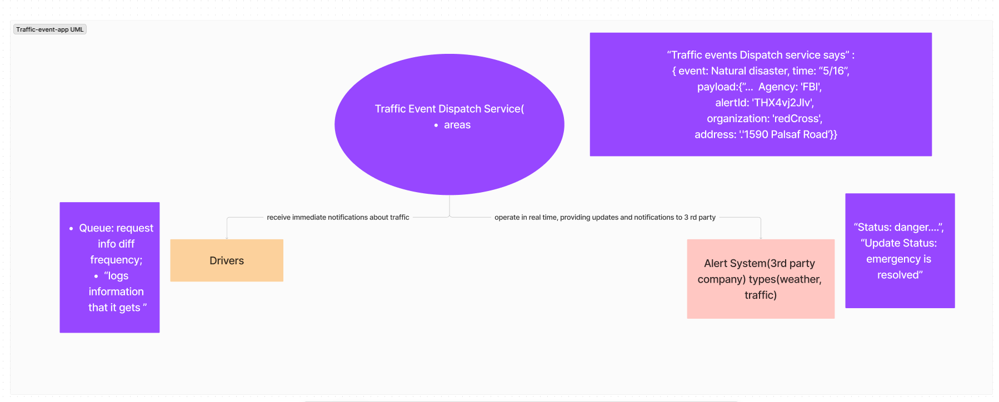

# traffic-event-app

# Traffic Event Dispatch Service

### Authors: Armen Agabekian, Brendan McMullen, and Qilin Xie

## Overview
The Traffic Event Dispatch Service is a system designed to manage traffic events and dispatch alerts to drivers and third-party systems in real-time. It provides updates and notifications about various types of alerts, including weather, and traffic incidents.

## Three Components (Servers)

### Traffic Event Dispatch Service: Responsible for managing traffic events and dispatching alerts. Ensures real-time updates and notifications to stakeholders.

#### Areas
- Represents different geographical zones where traffic events occur.

## Driver: Represents end-users who receive alerts and notifications about traffic events.
- Rely on the system to make informed decisions while driving.
### Queue
- Manages request information with different frequencies.
- Ensures efficient processing of incoming requests.

### Logs Information
- Stores and logs information received from various sources, such as agencies or organizations.
- Valuable for analysis, reporting, and future reference.

## Alert System(3rd party): - An external system integrated with the Traffic Event Dispatch Service.
- Provides additional alerts and status updates to drivers and stakeholders.
### Receive Immediate Notifications
- Capable of receiving immediate notifications about traffic events.
- Ensures timely updates and alerts for all stakeholders.

### Operate in Real Time
- Provides real-time updates and notifications to third-party systems and drivers.
- Ensures stakeholders are informed promptly.

### Type of Alerts
- Categorizes alerts into different types such as weather-related or traffic-related incidents.
- Each type has specific characteristics and handling procedures.

## UML Diagram
A UML diagram can visually represent the components and interactions of the Traffic Event Dispatch Service. It includes classes, relationships, and annotations to convey the system's structure and functionality effectively.

- UML diagram: 